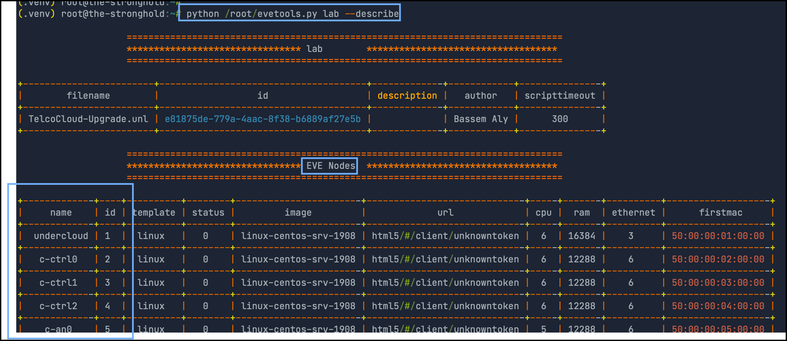
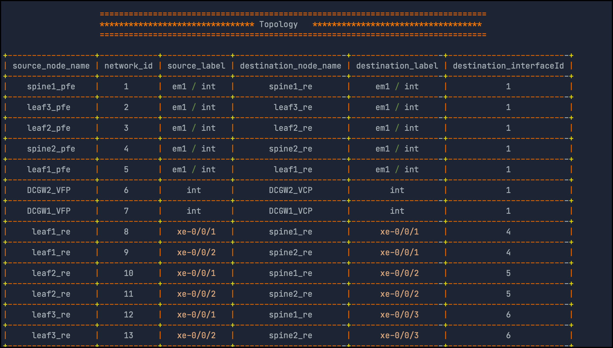
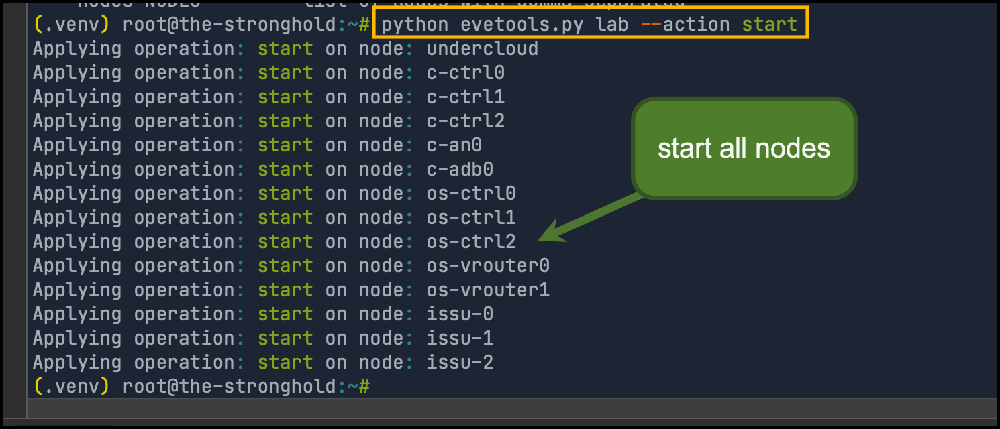
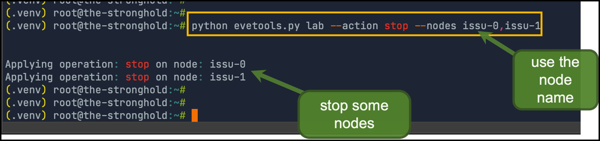
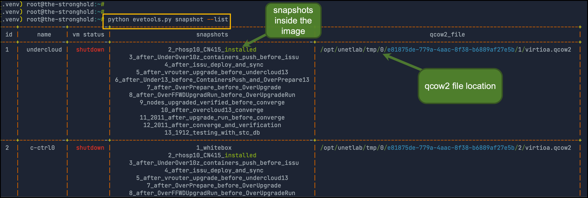
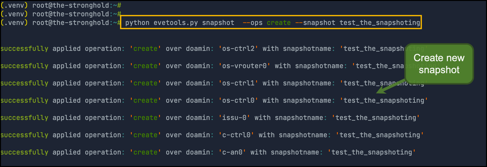
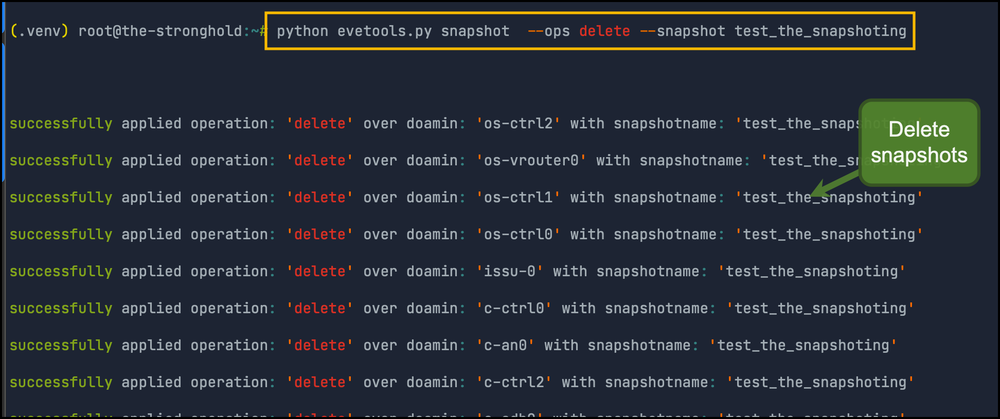
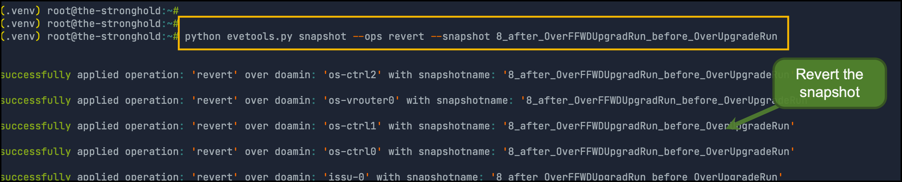

# eve-ng-tools

EVE-NG tools, A Utility to make operations with EVE-NG more friendly. Also it support different snapshot operations with same style as Libvirt/KVM


# Installation

The tool need to be hosted on the eve-ng server since it use some local commands to collect data. so please execute the below commands on the eve-ng server


## Create virtualenv

```sh
virtualenv --python /usr/bin/python3.10  .venv # use python version > 3.5
source .venv/bin/activate
```


## Clone Repo and install requirements

```sh

git clone https://github.com/TheNetworker/eve-ng-tools.git
cd eve-ng-tools
pip install -r requirements.txt

```


## Create lab env

```sh
cat << 'EOF' > /root/telco_lab.env 
for key in $( set | awk '{FS="="}  /^eve_/ {print $1}' ); do unset $key ; done
export eve_ip=192.168.100.252 #<-- Provide here the eve_ip address
export eve_lab_name=TelcoCloud-Upgrade.unl #<-- provide here the lab name
EOF

source /root/telco_lab.env
```


# Supported Operations

Two operations are currently supported

- Lab operations
- Snapshot operations


## Lab Operations: 

```sh
python evetools.py lab -h
usage: eve lab [-h] [--describe] [--action {start,stop,list}] [--nodes NODES]

options:
  -h, --help            show this help message and exit
  --describe            Describe the lab

  --action {start,stop,list}
                        Do operation over nodes
  --nodes NODES         list of nodes with comma separated
```


**Describe Lab**

```sh
python evetools.py lab --describe 
```






**Start all nodes in the lab**

```sh
python evetools.py lab --action start
```





**Stop some nodes** (omit `**--nodes**` to stop all of them)

```sh
python evetools.py lab --action stop --nodes issu-0,issu-1
```





## Snapshot operations

```sh
python evetools.py snapshot -h
usage: eve snapshot [-h] [--list] [--ops {create,revert,delete}] [--snapshot SNAPSHOT] [--nodes NODES]

options:
  -h, --help            show this help message and exit

  --list                list a snapshot

  --ops {create,revert,delete}
                        Create a snapshot
  --snapshot SNAPSHOT   snapshot name
  --nodes NODES         list of nodes with comma separated
```


**Listing Snapshots**

```sh
python evetools.py snapshot --list
```




**Creating new snapshot**

```sh
python evetools.py snapshot --ops create --snapshot test_the_snapshoting
```




**Deleting snapshots**

```sh
python evetools.py snapshot --ops delete --snapshot test_the_snapshoting
```





**Reverting  the snapshot**

```sh
python evetools.py snapshot --ops revert --snapshot test_the_snapshoting
```




## Questions/Discussion

If you find an issue with eve-tools, then you can open an issue on this projects issue page here: https://github.com/TheNetworker/eve-ng-tools/issues


## Suggestion and Feedback

[Click here](mailto:babdelmageed@juniper.net) if you have any feedback or suggestions.


