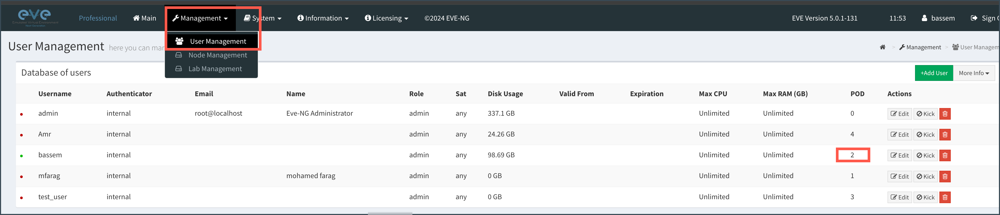
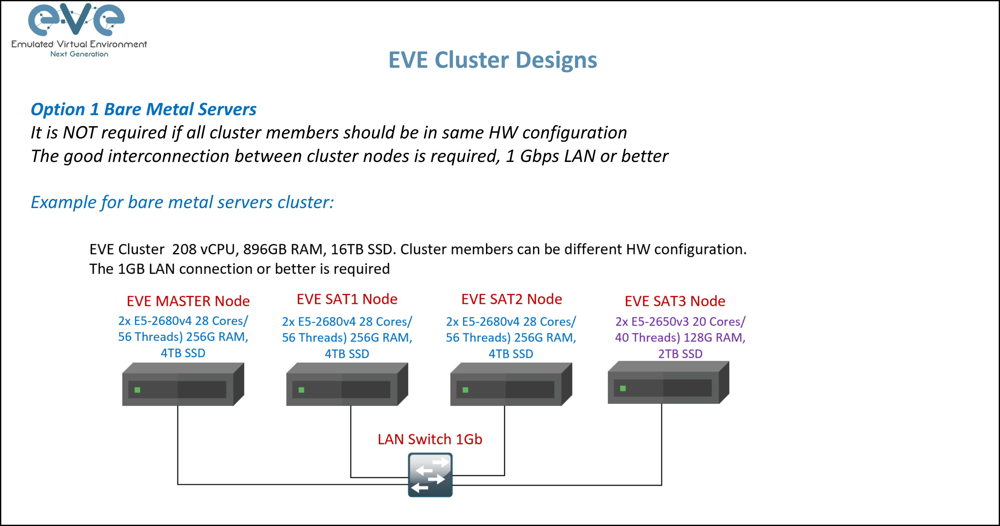

# eve-ng-tools

EVE-NG tools, A Utility to make operations with EVE-NG more friendly. Also it supports different snapshot operations with same style as Libvirt/KVM.


Also, this tool could be used to assist in migration from KVM to EVE-NG. Full details are described in the following blog post

https://basimaly.wordpress.com/2022/02/01/migrating-from-kvm-to-eve-ng/


# Installation

The tool need to be hosted on the eve-ng server since it use some local commands to collect data. so please execute the below commands on the eve-ng server


## Create virtualenv

```bash
# ubuntu
sudo apt-get install python3-pip -y
sudo pip3 install virtualenv

# RHEL 7/CentOS 8
sudo yum install python-virtualenv

# install virtualenv
virtualenv --python /usr/bin/python3  .venv # use python version > 3.5
source .venv/bin/activate
```


## Clone Repo and install requirements

```bash
rm -rf ~/eve-ng-tools || true
git clone https://github.com/TheNetworker/eve-ng-tools.git
cd eve-ng-tools
pip install -r requirements.txt

```


## Create lab env

```bash
cat << 'EOF' > /root/telco_lab.env 
for key in $( set | awk '{FS="="}  /^eve_/ {print $1}' ); do unset $key ; done
export eve_ip=192.168.100.252 #<-- Provide here the eve_ip address
export eve_user=admin #<-- Provide here your username
export eve_password=eve
export eve_lab_name=5G_Core_in_CSP.unl
export eve_lab_cnx_file="/root/5G_Core_in_CSP_CNX.yml"


EOF

source /root/telco_lab.env
```


> [!IMPORTANT]
>
> if you're working on EVE-NG environment with multiple users and pods, the tool will get the pod number and add it to the `user_tenant` vairbale to be used later in different operation
>
> 




## Working with eve-ng in cluster mode

The EVE-NG Professional edition supports adding multiple nodes to form a server cluster, also known as **satellites**, on which you can run your lab. EVE-NG will handle the connectivity between these clusters using WireGuard clients so they appear as a seamless connected on a same node although they're running on different ones.




Source: [EVE-NG Cluster Presentation](https://www.eve-ng.net/wp-content/uploads/2021/03/EVE_cluster_presentation-4.4-Pro.pdf)

However, this creates a problem when taking snapshots of nodes scheduled over those satellites, as `eve-ng-tools` expects the qcow2 files to be on the master node. Therefore, execute the commands below to remotely map the disk of `/opt/unetlab/tmp/` at the satellite node(s) to the master server. If directories are not mapped, eve-ng-tools will raise an error and exit.


```sh
# create directory per satellite server (here we have three satellite servers)
mkdir -p /root/sats/{1,2,3}

# install the sshfs package on eve-ng master 
sudo apt install sshfs -y

# remotely map the directory of sat1 (EX IP: 192.168.8.240)
sshfs -o allow_other,default_permissions -o reconnect -o cache=no -o identityfile=/root/.ssh/id_rsa root@192.168.8.240:/opt/unetlab/tmp/ /root/sats/1

# remotely map the directory of sat2 (EX IP: 192.168.8.230)
sshfs -o allow_other,default_permissions -o reconnect -o cache=no -o identityfile=/root/.ssh/id_rsa root@192.168.8.230:/opt/unetlab/tmp/ /root/sats/1

# remotely map the directory of sat3 (EX IP: 192.168.8.220)
sshfs -o allow_other,default_permissions -o reconnect -o cache=no -o identityfile=/root/.ssh/id_rsa root@192.168.8.220:/opt/unetlab/tmp/ /root/sats/3

```

> [!NOTE]
>
> You need to execute the same commands one more time if you rebooted the master node.


# Supported Operations

Two operations are currently supported

- Lab operations
- Snapshot operations


 

## Lab Operations: 

```bash
python evetools.py lab -h
usage: eve lab [-h] [--describe | --rack_and_stack | --cnx_body CNX_BODY | --de_rack_and_stack | --get_ansible_data] [--action {start,stop,list,init}] [--nodes NODES]

options:
  -h, --help            show this help message and exit
  --describe            Describe the lab
  --rack_and_stack      Connect the nodes with each other according to the topology file stored in env variable eve_lab_cnx_file
  --cnx_body CNX_BODY   provide the body of the connection request
  --de_rack_and_stack   disconnect the nodes from each other according to the topology file stored in env variable eve_lab_cnx_file
  --get_ansible_data    Get the data required by ansible playbooks to configure Day1 according to the topology file stored in env variable eve_lab_cnx_file

  --action {start,stop,list,init}
                        Do operation over nodes
  --nodes NODES         list of nodes with comma separated
```

 


**[1] Describe Lab**

```bash
python evetools.py lab --describe 
```


  

**[2] Start all nodes in the lab**

```bash
python evetools.py lab --action start
```


  

**[2-1] Start all nodes in the lab with a `delay` of 10 seconds to avoid CPU hogging** 

```bash
python evetools.py lab --action start --delay 10
```

  

**[3] Stop some nodes** (omit `**--nodes**` to stop all of them)

```bash
python evetools.py lab --action stop --nodes issu-0,issu-1
```


 

**[4] Rack and Stack nodes**

```sh
python evetools.py lab --rack_and_stack
```

This operation will read the connection file defined in lab env `eve_lab_cnx_file` (Please see file
named [5G_Core_in_CSP_CNX.yml](5G_Core_in_CSP_CNX.yml) for an example of connection) and will connect them according to
the cable plan. Very useful for architects exploring new design patterns or testing dramatic network changes. This
operation is *idempotent* . meaning you can run it multiple times and you will get the same result at the end.

Please see the below demo fro more infomration

*Watch Video Demo*

[](https://youtu.be/0zVloOPgIFk)

*CLI*


 

*Topology **before** the racking and stacking connection*


 

*Topology **after** the racking and stacking connection*


 

> [1] Please note the operation takes some time due to EVE-NG backend validation

 

> [2] Important: Please don't login to EVE-NG GUI until this operation is finished to avoid interrupting the API


 

**[5] Connect only one cable**

```sh
python evetools.py lab '{json_payload}'


EX:
python evetools.py lab --cnx_body '{ "src_node": "IGW2_R21" , "dst_node": "IGWRR1_R34" , "src_intf": "ge-0/0/2" ,"dst_intf": "ge-0/0/2"}'
```

This feature is a subset for the previous feature and will only connect two nodes with a single connection. useful for
adding missing connections without need to repeat pushing the full cable plan one more time.

 

**[6] De-Rack and Stack nodes**

```sh
python evetools.py lab --de_rack_and_stack
```

The opposite of previous feature, obviously!. it will remove the disconnect the nodes from each other this time

 

**[7] Get Ansible Data**

To be explained later

 

**[8] Adjust Qcow2 VM size**

To be explained later

 

** [9] Support reading the connection details from Juniper Apstra Cabling Map**

To be explained later

 

**[10] Get the console port**

```bash
python evetools.py lab --action get_console_port --nodes dcn1-leaf1   #node need to be powered-on
```


This could be used later in any EXPECT based script to configure the day0 configuration as in below

```bash
./eve_expect.sh vmx $(python evetools.py lab --action get_console_port --nodes vMX-VCP49 | grep -v '\->') 10.99.100.151/24
```


 

**The Result**


 

## Snapshot operations

```bash
python evetools.py snapshot -h
usage: eve snapshot [-h] [--list] [--ops {create,revert,delete}] [--snapshot SNAPSHOT] [--nodes NODES]

options:
  -h, --help            show this help message and exit

  --list                list a snapshot

  --ops {create,revert,delete}
                        Create a snapshot
  --snapshot SNAPSHOT   snapshot name
  --nodes NODES         list of nodes with comma separated
```

  

**[1] Listing Snapshots**

```sh
python evetools.py snapshot --list
```


  

**[2] Creating new snapshot**

```bash
python evetools.py snapshot --ops create --snapshot test_the_snapshoting
```


  

**[3] Deleting snapshots**

```bash
python evetools.py snapshot --ops delete --snapshot test_the_snapshoting
```


  

**[4] Reverting the snapshot**

```bash
python evetools.py snapshot --ops revert --snapshot test_the_snapshoting
```


  

## Questions/Discussion

If you find an issue with eve-tools, then you can open an issue on this projects issue page here: https://github.com/TheNetworker/eve-ng-tools/issues


## Suggestion and Feedback

[Click here](mailto:babdelmageed@juniper.net) if you have any feedback or suggestions.


